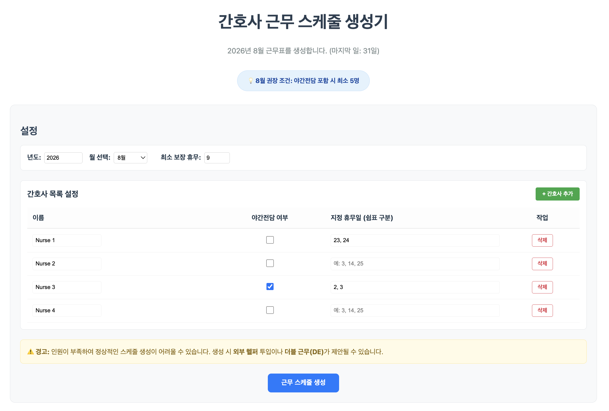
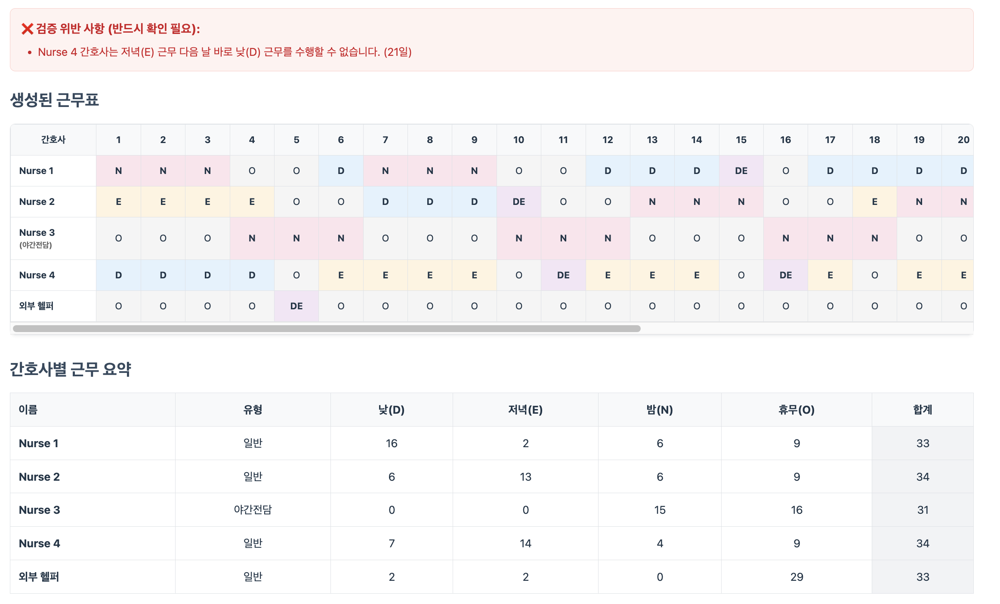

# 간호사 근무 스케줄 생성기 (Nurse Scheduler Generator)

복잡한 제약 조건을 자동으로 계산하여 최적의 월간 간호사 근무표를 생성하는 웹 애플리케이션입니다.
[서비스 이용하기](https://nurse-scheduler-generator.vercel.app)

## 📋 프로젝트 개요

병원 근무표 작성은 단순히 인원을 배치하는 것을 넘어, 야간 근무 패턴, 회복 휴식, 연속 근무 제한 등 수많은 의료법 및 노사 합의 제약 조건을 준수해야 하는 고난도의 작업입니다.

그동안 수동으로 작성하며 겪었던 **'시간 낭비'**와 **'실수로 인한 제약 위반'**의 불편함을 해결하기 위해 이 프로젝트가 시작되었습니다. 본 프로그램은 수학적 알고리즘을 통해 단 몇 초 만에 모든 제약 조건을 만족하는 스케줄을 제안합니다.

## ✨ 주요 해결 과제 (불편함 개선)

- **수동 작성의 고통 해소:** 엑셀이나 종이에 일일이 적어가며 머리를 싸매던 시간을 획기적으로 단축합니다.
- **복잡한 제약 조건 자동 검증:**
  - 야간 근무(N) 3일 연속 배치 및 이후 2~3일 휴식 보장
  - 최대 연속 근무 4일 제한 준수
  - 최소 보장 휴무 일수 체크
  - 저녁(E) 근무 후 다음 날 낮(D) 근무 금지 등
- **인력 공백 대응:** 인원이 부족하거나 지정 휴무가 겹칠 경우, **'외부 헬퍼'** 투입이나 **'더블 근무(DE)'**를 자동으로 제안하여 업무의 연속성을 보장합니다.
- **데이터 활용:** 생성된 스케줄을 즉시 엑셀(`.xlsx`)로 다운로드하여 현장에서 바로 사용할 수 있습니다.

## 📸 프로그램 스크린샷

_(이곳에 프로그램의 사진을 넣어주세요)_

|  |  |
| :-----------------------------: | :-----------------------------------: |
|      **인원 및 제약 설정**      |        **자동 생성된 근무표**         |

## 🛠 실행 환경 및 방법

### 실행 환경

- **Node.js:** v18 이상 권장
- **Package Manager:** npm (또는 yarn)
- **Framework:** React 19 (TypeScript)
- **Build Tool:** Vite

### 실행 방법

1. **저장소 클론**

   ```bash
   git clone <repository-url>
   cd nurse-scheduler-generator
   ```

2. **의존성 설치**

   ```bash
   npm install
   ```

3. **개발 서버 실행**

   ```bash
   npm run dev
   ```

   실행 후 브라우저에서 `http://localhost:5173` 접속

4. **테스트 실행 (로직 검증)**
   ```bash
   npm test
   ```

## ⚖️ 라이선스

이 프로젝트는 **PolyForm Noncommercial License 1.0.0**을 따릅니다. 비영리 목적으로만 사용, 수정 및 배포가 가능합니다. 상업적 이용을 원하실 경우 별도의 협의가 필요합니다.
